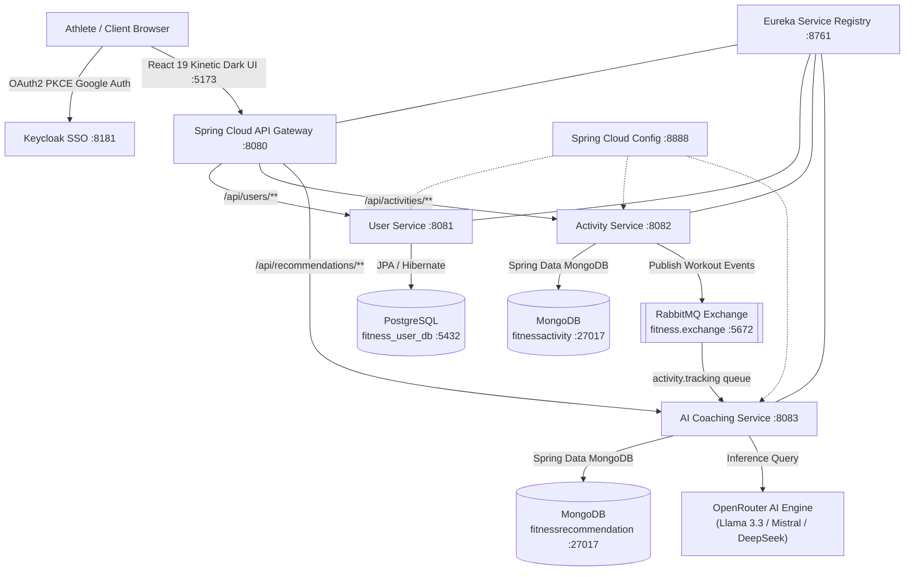

# ⚡ FitPulse AI — Event-Driven Fitness Tracking & AI Coaching Microservices

[](https://spring.io/projects/spring-boot)
[](https://spring.io/projects/spring-cloud)
[](https://react.dev/)
[](https://www.rabbitmq.com/)
[](https://www.mongodb.com/)
[](https://www.postgresql.org/)
[](https://openrouter.ai/)
[](https://www.docker.com/)

> **FitPulse AI** is a production-grade, event-driven fitness tracking and autonomous AI coaching ecosystem built with Spring Cloud microservices, React 19, RabbitMQ, Keycloak OAuth2 with PKCE, and OpenRouter neural intelligence.

---

## 🏛️ System Architecture



---

## ✨ Key Features

- 🤖 **Autonomous AI Coaching**: Evaluates workout duration, calorie burn, and intensity asynchronously via OpenRouter free-tier models (`openrouter/free`, `meta-llama/llama-3.3-70b-instruct:free`).
- ⚡ **Event-Driven Microservices**: Decoupled message routing with RabbitMQ exchange `fitness.exchange` and queue `activity.tracking`.
- 🔒 **Enterprise Authentication**: Keycloak OAuth2 with PKCE for secure 1-click Google Sign-In and automated PostgreSQL user provisioning.
- 📊 **Polyglot Persistence**: 
  - **PostgreSQL** (`fitness_user_db`) for relational user identity and profile state.
  - **MongoDB** (`fitnessactivity` & `fitnessrecommendation`) for time-series activity streams and AI coaching reports.
- 🎨 **Kinetic Dark UI**: Athletic dashboard built with React 19, Vite, Material UI, `Barlow Condensed` uppercase headings, `DM Sans`, and `JetBrains Mono` tabular telemetry.

---

## 🔌 Service & Port Mapping

| Service | Port | Technology | Purpose |
| :--- | :--- | :--- | :--- |
| **Frontend** | `5173` / `80` | React 19 + Vite + Nginx | Kinetic Dark athletic UI |
| **API Gateway** | `8080` | Spring Cloud Gateway | Central reactive routing & reverse proxy |
| **User Service** | `8081` | Spring Boot + PostgreSQL | Profile management & Google SSO sync |
| **Activity Service** | `8082` | Spring Boot + MongoDB + RabbitMQ | Workout logging & event publishing |
| **AI Service** | `8083` | Spring Boot + OpenRouter | Neural coaching generation & on-demand recovery |
| **Eureka Server** | `8761` | Netflix Eureka | Microservices discovery & heartbeat registry |
| **Config Server** | `8888` | Spring Cloud Config | Centralized configuration repository |
| **Keycloak SSO** | `8181` | Keycloak Identity | OAuth2 PKCE OpenID Connect provider |
| **RabbitMQ** | `5672` / `15672` | RabbitMQ 3.13 Management | High-throughput message broker |
| **PostgreSQL** | `5432` | PostgreSQL 17 | Relational database (`fitness_user_db`) |
| **MongoDB** | `27017` | MongoDB 7.0 | Document store (`fitnessactivity`, `fitnessrecommendation`) |

---

## ⚡ 1-Click Production Docker Deployment

Deploy the entire platform (frontend + 5 microservices + PostgreSQL + MongoDB + RabbitMQ) with Docker Compose:

### 1. Clone & Setup Environment
```bash
git clone https://github.com/SiddharthaGupta-2005/fitness-tracker-microservices.git
cd fitness-tracker-microservices
cp .env.example .env
```

### 2. Configure OpenRouter API Key
Edit `.env` and paste your key from [openrouter.ai/keys](https://openrouter.ai/keys):
```env
OPENROUTER_API_KEY=sk-or-v1-your-openrouter-key
```

### 3. Launch All 10 Containers
```bash
docker compose up -d --build
```
Access the application at **`http://localhost:5173`** (or **`http://localhost`**)!

---

## 💸 100% Free Cloud Deployment ($0/Month)

Deploy the entire stack without credit card charges using free tiers:

| Layer | Provider | Free Tier Benefits |
| :--- | :--- | :--- |
| **Frontend UI** | **[Vercel](https://vercel.com)** | 1-Click deploy from GitHub (Root: `fitness-tracker-frontend`) |
| **MongoDB Database** | **[MongoDB Atlas](https://www.mongodb.com/atlas)** | 512MB M0 Cluster (**Free Forever**) |
| **PostgreSQL Database** | **[Neon.tech](https://neon.tech)** | 500MB Serverless PostgreSQL (**Free Forever**) |
| **RabbitMQ Broker** | **[CloudAMQP](https://www.cloudamqp.com/)** | "Little Lemur" Plan (**Free Forever**) |
| **AI LLM Engine** | **[OpenRouter](https://openrouter.ai)** | Free-tier models (`openrouter/free`) |
| **Full Stack VPS** | **[Oracle Cloud Free Tier](https://www.oracle.com/cloud/free/)** | **4 OCPU, 24GB RAM Always-Free VPS** (Runs `docker compose` 24/7) |

---

## 🛠️ Local Development (IntelliJ IDEA)

1. Ensure **PostgreSQL (`5432`)**, **MongoDB (`27017`)**, **RabbitMQ (`5672`)**, and **Keycloak (`8181`)** are running.
2. Launch Spring Boot applications in sequence:
   - `EurekaApplication` (`:8761`)
   - `ConfigserverApplication` (`:8888`)
   - `GatewayApplication` (`:8080`)
   - `UserservicesApplication` (`:8081`)
   - `AcitvityservicesApplication` (`:8082`)
   - `AiserviceApplication` (`:8083`) *(Set `OPENROUTER_API_KEY=sk-or-v1-...` in Run Config)*
3. Start frontend dev server:
   ```bash
   cd fitness-tracker-frontend
   npm install
   npm run dev
   ```

---

## 📜 License
MIT License. Developed by [Siddhartha Gupta](https://github.com/SiddharthaGupta-2005).
