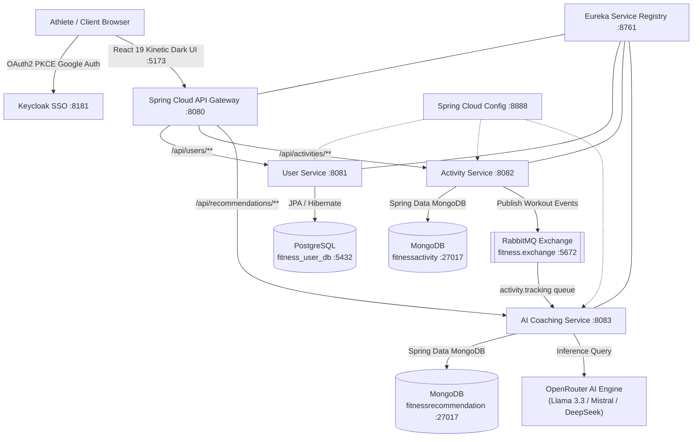

# ⚡ FitPulse AI — Event-Driven Fitness Tracking & AI Coaching Microservices

[](https://spring.io/projects/spring-boot)
[](https://spring.io/projects/spring-cloud)
[](https://react.dev/)
[](https://www.rabbitmq.com/)
[](https://www.mongodb.com/)
[](https://www.postgresql.org/)
[](https://openrouter.ai/)
[](https://www.docker.com/)

> **FitPulse AI** is a production-grade, event-driven fitness tracking and autonomous AI coaching ecosystem built on Spring Cloud microservices, React 19, RabbitMQ, Keycloak OAuth2 with PKCE, and OpenRouter neural intelligence.

---

## 🏛️ System Architecture



---

## ✨ Key Features

- 🤖 **Neural AI Coaching**: Evaluates workouts asynchronously via OpenRouter free-tier models (`openrouter/free`, `meta-llama/llama-3.3-70b-instruct:free`) with on-demand fallback recovery.
- ⚡ **Event-Driven Microservices**: Decoupled message routing with RabbitMQ exchanges and dead-letter tolerance.
- 🔒 **Enterprise Authentication**: Keycloak OAuth2 with PKCE for secure 1-click Google Sign-In and automated PostgreSQL user provisioning.
- 📊 **Polyglot Persistence**: 
  - **PostgreSQL** (`fitness_user_db`) for relational user state.
  - **MongoDB** (`fitnessactivity` & `fitnessrecommendation`) for high-throughput time-series telemetry and AI coaching reports.
- 🎨 **Kinetic Dark UI**: Built with React 19, Vite, Material UI, `Barlow Condensed` athletic headings, `DM Sans`, and `JetBrains Mono` tabular telemetry.

---

## 🔌 Microservice Port Mapping

| Service | Port | Description |
| :--- | :--- | :--- |
| **API Gateway** | `8080` | Central reactive routing & authentication gateway |
| **User Service** | `8081` | Manages athlete profiles and Google SSO synchronizations |
| **Activity Service** | `8082` | Ingests workouts and publishes to RabbitMQ |
| **AI Service** | `8083` | Generates structured coaching analyses via OpenRouter |
| **Eureka Server** | `8761` | Dynamic microservice discovery registry |
| **Config Server** | `8888` | Centralized external configuration repository |
| **Keycloak SSO** | `8181` | OAuth2 & OIDC Identity Provider |
| **RabbitMQ** | `5672` / `15672` | High-throughput AMQP message broker |
| **PostgreSQL** | `5432` | Relational database (`fitness_user_db`) |
| **MongoDB** | `27017` | Document database (`fitnessactivity`, `fitnessrecommendation`) |
| **Frontend** | `5173` / `80` | Kinetic Dark athletic React dashboard |

---

## ⚡ 1-Click Production Docker Deployment

### 1. Clone & Configure
```bash
git clone https://github.com/SiddharthaGupta-2005/fitness-tracker-microservices.git
cd fitness-tracker-microservices
cp .env.example .env
```

### 2. Add your OpenRouter API Key in `.env`
```env
OPENROUTER_API_KEY=sk-or-v1-your-key-here
```

### 3. Launch All 10 Containers
```bash
docker compose up -d --build
```
Open **`http://localhost:5173`** (or **`http://localhost`**) to use the application!

---

## 💸 100% Free Cloud Deployment

Looking to deploy to the cloud for **$0/month**?
Check out our comprehensive step-by-step free guide:
👉 **[FREE_DEPLOYMENT_GUIDE.md](FREE_DEPLOYMENT_GUIDE.md)** (Covers Vercel, MongoDB Atlas, Neon PostgreSQL, CloudAMQP, and Oracle Cloud Always-Free).

---

## 🛠️ Local Development (IntelliJ IDEA)

1. Start infrastructure services: **PostgreSQL (`5432`)**, **MongoDB (`27017`)**, **RabbitMQ (`5672`)**, and **Keycloak (`8181`)**.
2. Run Spring Boot applications in this sequence:
   - `EurekaApplication` (`:8761`)
   - `ConfigserverApplication` (`:8888`)
   - `GatewayApplication` (`:8080`)
   - `UserservicesApplication` (`:8081`)
   - `AcitvityservicesApplication` (`:8082`)
   - `AiserviceApplication` (`:8083`) *(Set `OPENROUTER_API_KEY=sk-or-v1-...` in Run Config)*
3. Start frontend:
   ```bash
   cd fitness-tracker-frontend
   npm install
   npm run dev
   ```

---

## 📜 License
MIT License. Created by [Siddhartha Gupta](https://github.com/SiddharthaGupta-2005).
